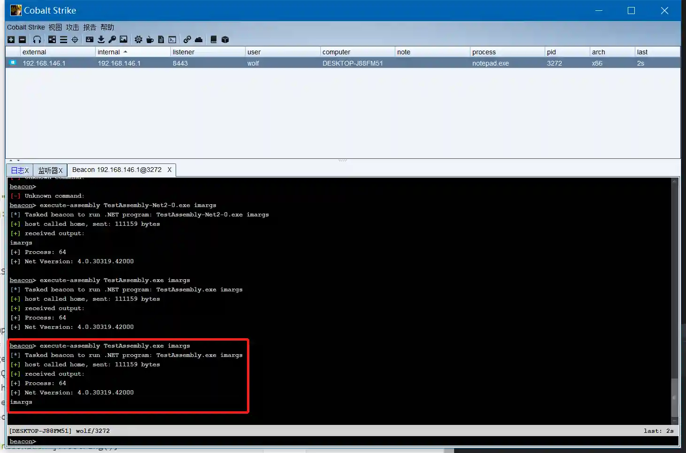
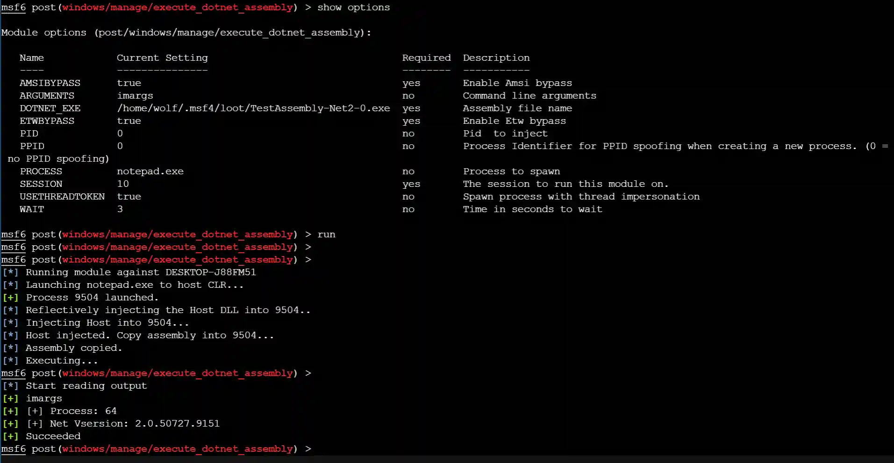
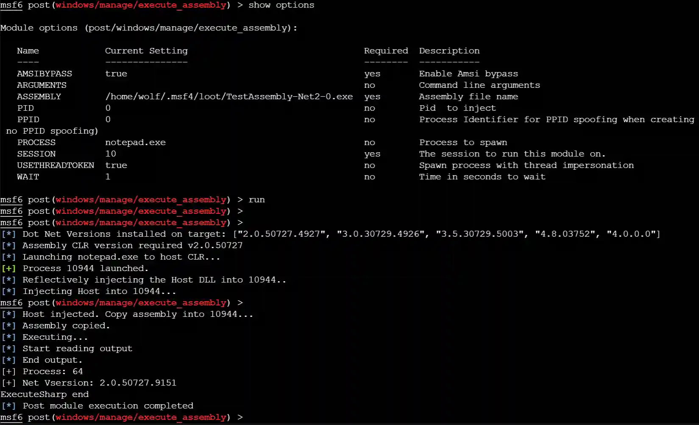

# msf execute-assembly与CoabltStrike execute-assembly

## 前言
metasploit-framework和cobalt strike(简称CS)是当前主流的两个红队评估工具.

<font style="color:#262626;">在红队评估过程中为了与杀软对抗,无文件渗透是实现免杀的简单有效的手段.</font>

<font style="color:#262626;">execute-assembly是用于内存执行C#可执行文件的常用手法,当前</font>metasploit-framework和cobalt strike都已经实现了<font style="color:#262626;">execute-assembly功能,本文通过源码分析的方式演示</font><font style="color:#262626;">execute-assembly功能使用方式,并讲解如何修复使用过程中遇到的问题.</font><font style="color:#262626;"></font>

# CobaltStrike的execute-assembly
execute-assembly是CoabltStrike的重要功能,在获取beacon后,只需要编译完成的C#可执行文件拷贝到cobalestrike本地目录,然后执行 `execute-assembly [/path/to/file.exe] [arguments]` 即可在beacon内存执行,并获取可执行文件的输出.

使用如下C#代码生成C#可执行文件 `TestAssembly.exe` 

```csharp
using System;
using System.Management;

namespace TestAssembly
{
    class Program
    {
        static void Main(string[] args)
        {

            Console.WriteLine("[+] Process: {0}",Distinguish64or32System());
            Console.WriteLine("[+] Net Vsersion: {0}", Environment.Version.ToString());
			Console.WriteLine(args[0]);
        }

        private static string Distinguish64or32System()
        {
            try
            {
                string addressWidth = String.Empty;
                ConnectionOptions mConnOption = new ConnectionOptions();
                ManagementScope mMs = new ManagementScope("//localhost", mConnOption);
                ObjectQuery mQuery = new ObjectQuery("select AddressWidth from Win32_Processor");
                ManagementObjectSearcher mSearcher = new ManagementObjectSearcher(mMs, mQuery);
                ManagementObjectCollection mObjectCollection = mSearcher.Get();
                foreach (ManagementObject mObject in mObjectCollection)
                {
                    addressWidth = mObject["AddressWidth"].ToString();
                }
                return addressWidth;
            }
            catch (Exception ex)
            {
                return String.Empty;
            }
        }
    }
}

```

CobaltStrike执行效果如下



因为execute-assembly使用方便,免杀效果好,只需要将已有的C#安全工具拷贝到CoabltStrike目录,添加简单的cna界面,就可以封装成一个CoabltStrike插件发布,因此深受国内安全人员喜爱.


# metasploit-framework的execute-assembly (官方版本)
MSF当前官方已经通过模块的方式集成了execute-assembly.

功能最初由b4rtik发布于其个人仓库[metasploit-execute-assembly](https://github.com/b4rtik/metasploit-execute-assembly),项目的readme中对开发流程及实现原理进行了详细的说明.

其核心原理主要通过`Reflective dll`在内存中创建CLR环境,将C#可执行文件读取到内存中,然后执行.

后续b4tik还将其移植到msf官方,模块地址[execute_dotnet_assembly](https://github.com/rapid7/metasploit-framework/blob/master/modules/post/windows/manage/execute_dotnet_assembly.rb).

模块的使用效果如下:




# metasploit-framework的execute-assembly存在的问题
虽然MSF官方的execute-assembly的基本功能已经可以使用,但是在部分特殊情况下模块运行会出现问题.我们这里来进行简单分析.

## 问题1:模块只支持x64位环境
我们通过以下 [链接](https://github.com/rapid7/metasploit-framework/tree/master/data/post/execute-dotnet-assembly) 可以返现,b4rtik只提供了HostingCLRx64.dll一个适配x64位的dll文件,并没有提供x86环境所需的文件.

我们通过分析HostingCLRx64.dll的源代码 [Syscalls.asm](https://github.com/rapid7/metasploit-framework/blob/master/external/source/HostingCLR_inject/HostingCLR/Syscalls.asm) 发现,b4rtik为了实现ETW功能,在项目中加入了汇编代码,而汇编代码只适配了x64环境,所以导致最终模块只支持x64.

## 问题2:模块在只安装.net2.0的环境中无法使用
通过实测发现,如果windows操作系统自安装了.net2.0,没有安装.net3.5或.net4.0(比如干净的windows server 2008 x64 r2),msf的官方模块是无法使用的.

我们通过分析HostingCLRx64.dll的源代码 [HostingCLR.cpp](https://github.com/rapid7/metasploit-framework/blob/master/external/source/HostingCLR_inject/HostingCLR/HostingCLR.cpp) , 在161行有如下代码

```cpp
	hr = CLRCreateInstance(CLSID_CLRMetaHost, IID_ICLRMetaHost, (VOID**)&pMetaHost);

	if(FAILED(hr))
	{
		printf("CLRCreateInstance failed w/hr 0x%08lx\n", hr);
		return -1;
	}
```

通过查阅microsoft的官方文档 [链接](https://docs.microsoft.com/zh-cn/dotnet/framework/unmanaged-api/hosting/clrcreateinstance-function) ,CLRCreateInstance函数在.NET Framework 版本,自 4 之后可用,所以如果没有安装.net4.0的环境是无法使用msf官方模块的.

## 问题3:如果C#可执行文件可接受参数,但是没有输入参数,无法获取默认输出
一图胜千言


可以看到,按照C#代码的正常逻辑,应该输出

```cpp
[+] [+] Process: 64
[+] [+] Net Vsersion: 2.0.50727.9151
```

但是模块运行报错了,错误是 pMethodInfo->Invoke_3  w/hr 0x8002000e.

我们通过分析HostingCLRx64.dll的源代码 [HostingCLR.cpp](https://github.com/rapid7/metasploit-framework/blob/master/external/source/HostingCLR_inject/HostingCLR/HostingCLR.cpp) , 在269行有如下代码

```cpp
	if(arg_s[0] != '\x00')
	{
		//if we have at least 1 parameter set cEleemnt to 1
		psaStaticMethodArgs = SafeArrayCreateVector(VT_VARIANT, 0, 1);

		LPWSTR *szArglist;
		int nArgs;
		wchar_t *wtext = (wchar_t *)malloc((sizeof(wchar_t) * raw_args_length +1));

		mbstowcs(wtext, (char *)arg_s, raw_args_length + 1);
		szArglist = CommandLineToArgvW(wtext, &nArgs);

		free(wtext);

		vtPsa.parray = SafeArrayCreateVector(VT_BSTR, 0, nArgs);

		for(long i = 0;i< nArgs;i++)
		{
			size_t converted;
			size_t strlength = wcslen(szArglist[i]) + 1;
			OLECHAR *sOleText1 = new OLECHAR[strlength];
			char * buffer = (char *)malloc(strlength * sizeof(char));
			
			wcstombs(buffer, szArglist[i], strlength);
			
			mbstowcs_s(&converted, sOleText1, strlength, buffer, strlength);
			BSTR strParam1 = SysAllocString(sOleText1);

			SafeArrayPutElement(vtPsa.parray, &i, strParam1);
			free(buffer);
		}

		long iEventCdIdx(0);
		hr = SafeArrayPutElement(psaStaticMethodArgs, &iEventCdIdx, &vtPsa);
	}
	else
	{
		//if no parameters set cEleemnt to 0
		psaStaticMethodArgs = SafeArrayCreateVector(VT_VARIANT, 0, 0);
	}
	//Assembly execution
	hr = pMethodInfo->Invoke_3(obj, psaStaticMethodArgs, &retVal);
	if(FAILED(hr))
	{
		printf("Failed pMethodInfo->Invoke_3  w/hr 0x%08lx\n", hr);
		return -1;
	}
```

可以发现,如果C#代码中以 static void Main(string[] args) 作为入口函数,但是执行时未输入参数,会导致HostingCLRx64.dll错误的使用psaStaticMethodArgs = SafeArrayCreateVector(VT_VARIANT, 0, 0);生成输入向量,导致后续pMethodInfo->Invoke_3执行失败.


# metasploit-framework的execute-assembly(修复版本)
msf官方execute-assembly的三个问题都是可以修复或者绕过的.


## 问题1:模块只支持x64位环境(修复方法)
通常情况下ETW功能不影响免杀及执行,直接删除ETW功能,将将dll文件生成x86版本即可.

## 问题2:模块在只安装.net2.0的环境中无法使用(修复方法)
问题主要由CLRCreateInstance函数引起,在.net2.0中可以使用CorBindToRuntimeEx函数替代CLRCreateInstance,实现相同的功能.

## 问题3:如果C#可执行文件可接受参数,但是没有输入参数,无法获取默认输出(修复方法)
绝大多数的C#程序都是使用static void Main(string[] args) 作为入口函数,只要将HostingCLR.cpp中修改参数解析部分,无论是否输入参数皆按照输入参数模式处理即可,代码如下:

```cpp
	if(arg_s[0] != '\x00')
	{
		//if we have at least 1 parameter set cEleemnt to 1
		psaStaticMethodArgs = SafeArrayCreateVector(VT_VARIANT, 0, 1);

		LPWSTR *szArglist;
		int nArgs;
		wchar_t *wtext = (wchar_t *)malloc((sizeof(wchar_t) * raw_args_length +1));

		mbstowcs(wtext, (char *)arg_s, raw_args_length + 1);
		szArglist = CommandLineToArgvW(wtext, &nArgs);

		free(wtext);

		vtPsa.parray = SafeArrayCreateVector(VT_BSTR, 0, nArgs);

		for(long i = 0;i< nArgs;i++)
		{
			size_t converted;
			size_t strlength = wcslen(szArglist[i]) + 1;
			OLECHAR *sOleText1 = new OLECHAR[strlength];
			char * buffer = (char *)malloc(strlength * sizeof(char));
			
			wcstombs(buffer, szArglist[i], strlength);
			
			mbstowcs_s(&converted, sOleText1, strlength, buffer, strlength);
			BSTR strParam1 = SysAllocString(sOleText1);

			SafeArrayPutElement(vtPsa.parray, &i, strParam1);
			free(buffer);
		}

		long iEventCdIdx(0);
		hr = SafeArrayPutElement(psaStaticMethodArgs, &iEventCdIdx, &vtPsa);
	}
	else
	{
		//if no parameters set cEleemnt to 0
		psaStaticMethodArgs = SafeArrayCreateVector(VT_VARIANT, 0, 1);
		long iEventCdIdx(0);
		vtPsa.parray = SafeArrayCreateVector(VT_BSTR, 0, 0);
		hr = SafeArrayPutElement(psaStaticMethodArgs, &iEventCdIdx, &vtPsa);
	}
```


修复后效果如下:




# 相关源码
修复后的msf execute-assembly代码如下

[https://github.com/FunnyWolf/execute-assembly](https://github.com/FunnyWolf/execute-assembly)


