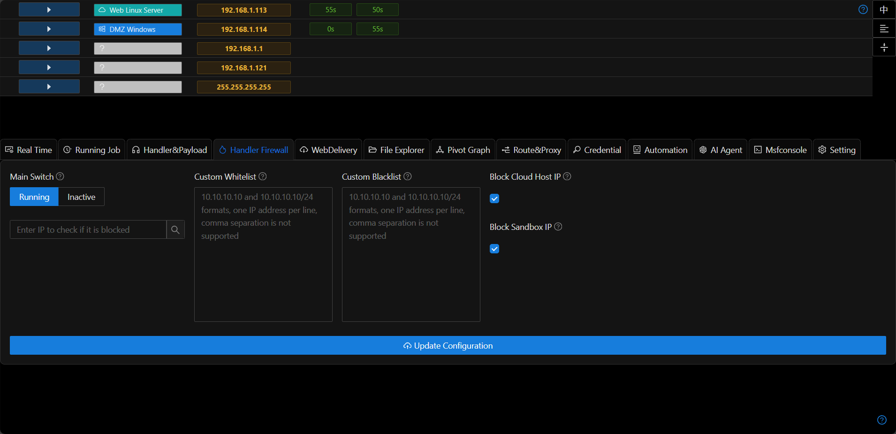
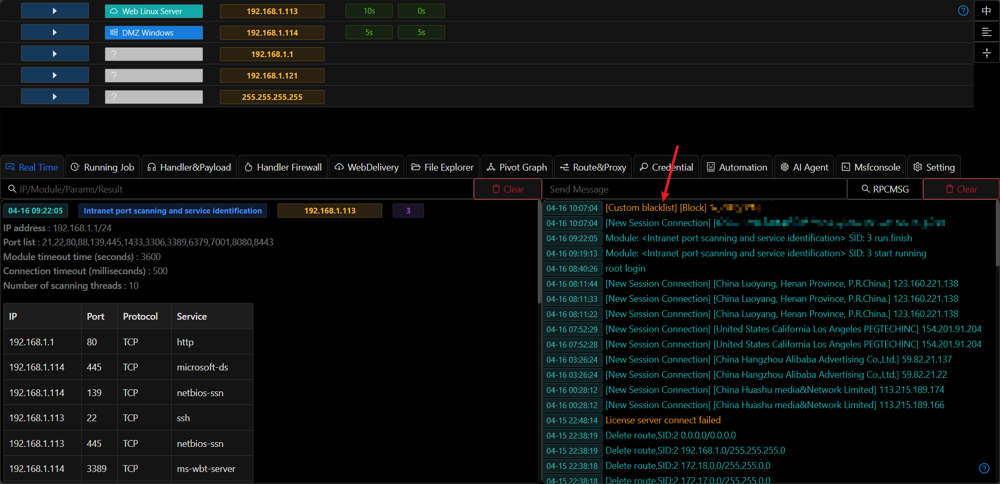
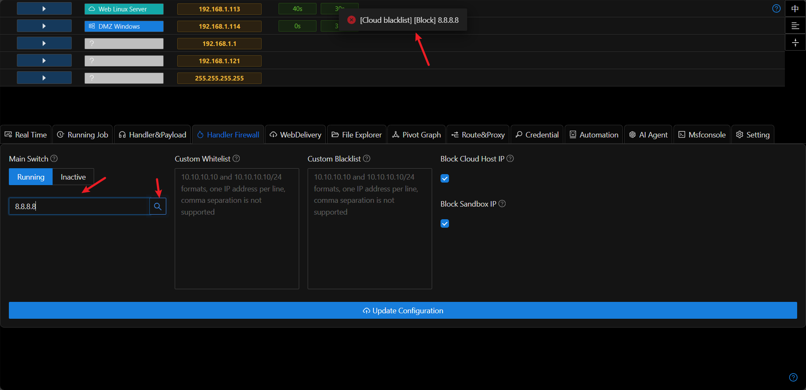

# Handler Firewall

Whenever a client connects to Viper's listener, Viper determines whether the IP of the client is allowed to connect based on the client's network IP address. If allowed, the payload is transmitted to the client as normal; if not, the network connection is disconnected directly.

## Usage Scenarios

+ When using spear-phishing, if the target's geographical location is a fixed area (such as a province), the handler firewall can block connections from IPs outside the country or from other provinces to the listener.
+ During red team simulations, connections from sandbox and network mapping servers can be blocked as needed.
+ If an IP address is not allowed to connect to the listener, the client (usually a sandbox or blue team personnel) cannot obtain the stager, and thus cannot determine the type of the C2 server.

## How to Use

1. Turn on the master switch and fill in the corresponding configuration.
2. For the corresponding description of the configuration, click "?" to view.
3. The IP address filtering check is performed from left to right and from top to bottom.

> + Master firewall switch off -> Allow access
> + Master firewall switch on -> Proceed to the next check
> + Custom whitelist match -> Allow access
> + Custom whitelist no match -> Proceed to the next check
> + Custom blacklist match -> Block
> + Custom blacklist no match -> Proceed to the next check
> + Block cloud providers match -> Block
> + Block cloud providers no match -> Proceed to the next check
> + Block sandbox IPs match -> Block
> + Block sandbox IPs no match -> Proceed to the next check
> + Geographical blacklist match -> Block
> + Geographical blacklist no match -> Allow access

4. If you need to confirm whether a certain IP is filtered, you can use the search function on the left to confirm.

5. Execution effect
   When an IP not in the allowed list connects to Viper's listener, a blocking prompt will be received.