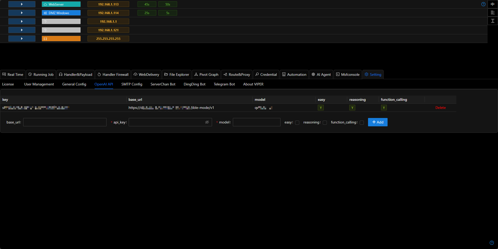
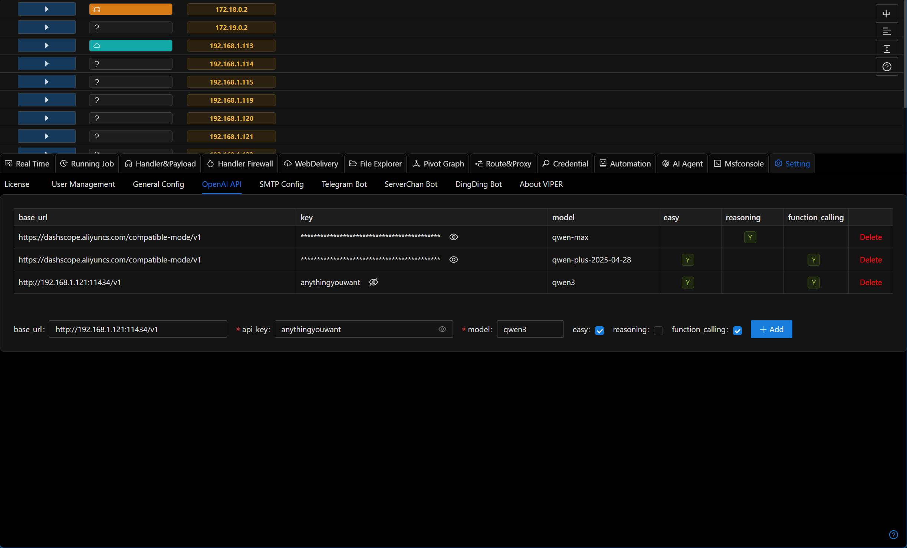

# OPENAI API

The agent relies on OpenAI-compatible APIs. Please configure your API key before use.



## Easy / Reasoning / Function_calling

- You can add multiple configurations, each meeting different functional requirements.
- For example, models like o3-mini, deepseek-r1, etc. should select the reasoning tag for tasks requiring stronger planning or reasoning capabilities.
- Models like gpt-4o-mini, qwen-turbo, etc. should select easy and function_calling tags for scenarios where the agent needs to call APIs.
- Through diversified configurations, you can achieve a balance between cost, effectiveness, and speed.

## Configuration Methods for Common Model Providers

Viper is compatible with all OpenAI format APIs. You can use any model compatible with the OpenAI interface. Below are configuration methods for common model providers:

### Ollama

+ Download the required model

```shell
ollama pull qwen3 # You can choose any model that supports function calling
```

+ Set the OLLAMA_HOST environment variable to 0.0.0.0

```shell
export OLLAMA_HOST=0.0.0.0
```

+ Start the Ollama service

```shell
ollama serve
```

+ Fill in the configuration in Viper: base_url should be http://192.168.1.121:11434/v1 (where 192.168.1.121 is the IP address of the Ollama server), api_key can be any value, model should be the name of the pulled model (qwen3), and check the easy and function_calling options (the reasoning field is currently not in use)



### Alibaba Cloud Bailian Platform

+ Log in to Alibaba Cloud Bailian Platform https://bailian.console.aliyun.com/

+ Add api_key https://bailian.console.aliyun.com/?tab=model#/api-key

+ Visit the model marketplace and select the desired model https://bailian.console.aliyun.com/?tab=model#/model-market (some models have free quotas, recommended)

+ Fill in the configuration in Viper: base_url should be https://dashscope.aliyuncs.com/compatible-mode/v1, api_key should be the key generated in the previous step, model should be the selected model (such as qwen-plus/qwen-plus-2025-04-28)

+ Check the easy and function_calling options (the reasoning field is currently not in use)

### Volcano Engine

+ Log in to Volcano Engine https://console.volcengine.com/

+ Select the desired model from the model marketplace

+ Click on `Inference` to get the base_url, api_key, and model

+ Fill in the configuration in Viper

+ Check the easy and function_calling options (the reasoning field is currently not in use)


### Google Gemini

+ Log in to https://aistudio.google.com/apikey to get your API key

+ Fill in the configuration in Viper: base_url should be https://generativelanguage.googleapis.com/v1beta/openai/, api_key should be the key obtained in the previous step, model should be gemini-2.0-flash

+ Check the easy and function_calling options (the reasoning field is currently not in use)
