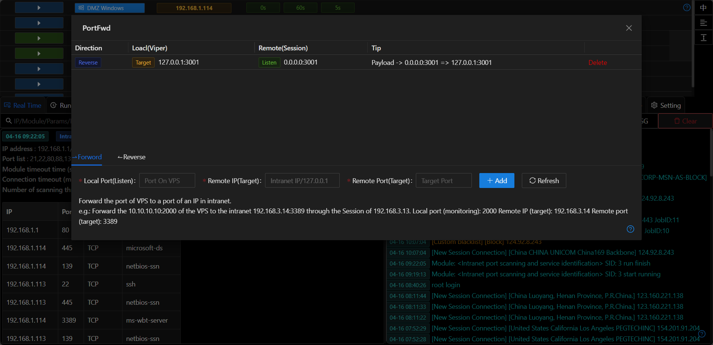

# Port Forwarding

## Forward Forwarding

- Forward forwarding is to forward the network port of the VPS to a specific IP and port within the intranet where the Session is located. It is often used to connect to certain services within the intranet, such as RDP, SSH, etc.
- For example, to map 127.0.0.1:3389 of the host where the Session is located to port 33899 of the VPS, select `Forward`, local port `33899`, remote IP `127.0.0.1`, and remote port `3389`.
- `Remote IP (target)` and `Remote port (target)` can also be filled with other hosts within the intranet.

## Reverse Forwarding

- Reverse forwarding is to forward a specific IP and port within the intranet to the network port of the VPS.
- Reverse forwarding is usually used for the callback connection of the handler's listening.

- Suppose you have obtained the privileges of the intranet 192.168.3.13 and established a Session. Through some channels, you learn that other machines in the 192.168.3.0/24 network segment cannot directly connect to the Internet, that is, they cannot directly connect to your VPS.

  At this time, you can establish reverse forwarding. Local IP `192.168.3.13`, local port `2000`, remote IP `127.0.0.1`, remote port `20000`. All intranet machines connecting to 192.168.3.13:20000 is equivalent to connecting to port 2000 of the VPS.

  At the same time, establish a listener on port 2000 and create a virtual listener at 192.168.3.13:20000. At this time, the virtual listener 192.168.3.13:20000 can be used as a payload to attack other machines within the intranet. Even if they cannot directly connect to the VPS.

> For information related to handler and virtual handler, please refer to [Handler Payload](./handler_and_payload)