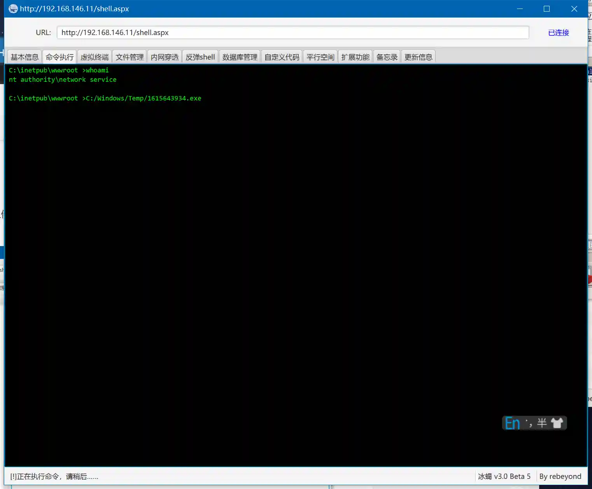
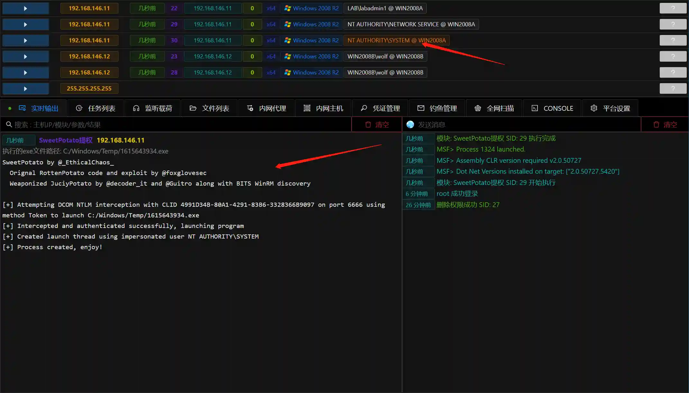

# Privilege Escalation with SweetPotato

The module uses SweetPotato.exe to escalate privileges.

SweetPotato requires local service permissions, such as the Network Service of IIS.

## Note
Some IIS servers are launched using the ApplicationPoolIdentity user. This user is a virtual user and privilege escalation is not possible.

The specific symptom is that commands can be executed using a webshell, but external executables cannot be executed.

## Operation Method
+ Take IIS privilege escalation as an example for illustration.
+ Add a listener and generate a payload.
+ Use a webshell to upload the payload to the target and execute it.

+ At this point, a Session with Network Service privileges is obtained.

+ Use the generated Session to run the module, and still fill in the payload uploaded before running as the parameter.

+ Run the module to obtain a SYSTEM privilege Session.

