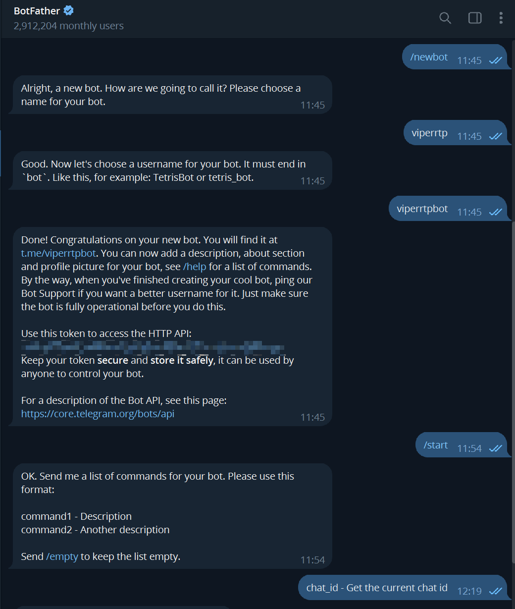

# Create a Free Telegram Bot in Ten Minutes

> This article will show you how to quickly create a Telegram Bot and implement its backend service using Cloudflare Worker - the whole process is completely free and takes only 10
> minutes.


## Why Do I Need a Telegram Bot

[Viper](https://www.viperrtp.com/) integrated Telegram Bot functionality in its early versions for sending system notifications to users. In previous versions, users had to follow
these steps to configure this feature:

- Send /newbot to Telegram's BotFather to create a bot
- Fill in the bot's name/username
- Get the bot's token (a super long string)
- Visit the newly created bot, send /start to initiate a new conversation
- Fill in the token in [Viper](https://www.viperrtp.com/), click update to get the chat_id list
- Select a chat_id in [Viper](https://www.viperrtp.com/), click update
- [Viper](https://www.viperrtp.com/) sends a test message using the token and chat_id, configuration complete

The whole process was like, well, imagine going to a restaurant but having to grow your own vegetables first - way too complicated.

In the new version, configuring Telegram Bot goes like this:

+ Search for viperrtp on Telegram, send /start to initiate a new conversation
+ Enter /chat_id to get your chat_id (10 digits)
+ Enter the chat_id you just got in the configuration page, [Viper](https://www.viperrtp.com/) will automatically send a test message

The whole process is super smooth. While using it, I found several advantages of Telegram Bot:

- Users only need to chat with the bot or send commands to access your services - no need to build a frontend interface, and users don't need to install apps or visit websites
- The bot interacts with backend services using webhooks - developing bot backend services is no different from developing a REST API webserver
- telegram + cloudflare worker comes at zero cost, completely free

## Getting Started

Before starting, you'll need three accounts:

- telegram account (obviously)
- github account (for managing backend code)
- cloudflare account (for deploying Bot backend service)

### Creating Bot in Telegram

The bot created in telegram can be understood as the Bot's UI interface, used for interaction through dialogue with the Bot. All interface parts can be configured in BotFather.

- Send /newbot to Telegram's BotFather to create bot
- Enter bot's name/username
- Get bot's token (a super long string)
- Register a command (like chat_id)



### Creating Bot Backend Code

I recommend using the Cursor method, here's my prompt:

```
Help me create a cloudflare worker project and all code for a telegram bot called YYYbot backend service, with domain https://xxx.YYY.workers.dev in cloudflare
The bot has the following features:
1. When user sends /chat_id, return the current chat's chat_id
2. External code can send messages to specified chat_id through https://xxx.YYY.workers.dev/send_message using POST
```

The generated project can be uploaded to github without modifications.

Of course, you can also use my already created project [free_telegram_bot](https://github.com/FunnyWolf/free_telegram_bot)

### Deploying Backend (cloudflare worker)

- Open cloudflare worker page, click create
- Select Import a repository, choose the newly created code repository and click deploy


- Set the bot's webhook to point to the new worker

```shell
curl -F "url=https://XXX.YYY.workers.dev" https://api.telegram.org/bot<YOUR_BOT_TOKEN>/setWebhook
```

- All done! Now you can test by sending chat_id to your bot

## Future Extensions

If your target audience overlaps with telegram users (like [Viper](https://www.viperrtp.com/)), the combination of telegram bot and cloudflare worker can meet most needs.

As the internet's famous **Cyber Buddha**, cloudflare offers 1 million free access requests per day for workers, which is more than enough for interactive requests. If you need
database functionality, you can also use cloudflare D1 or supabase.