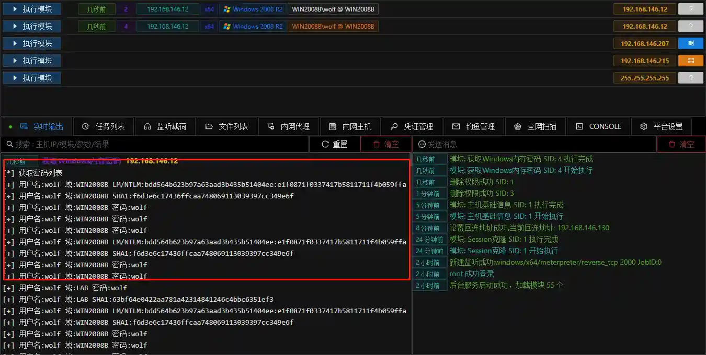
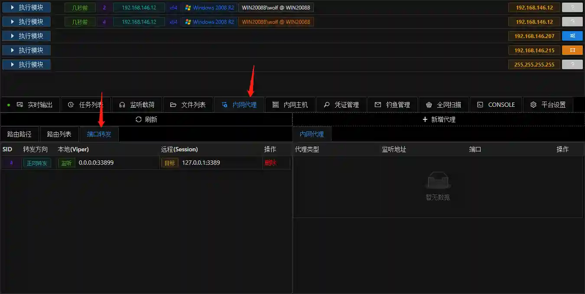
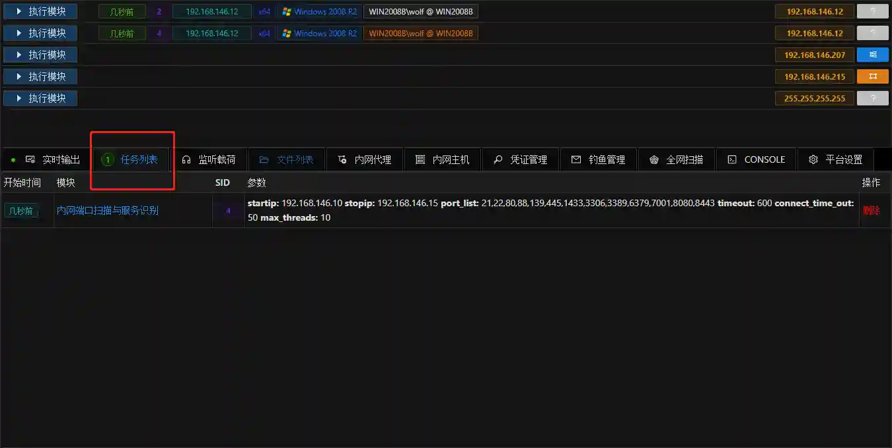
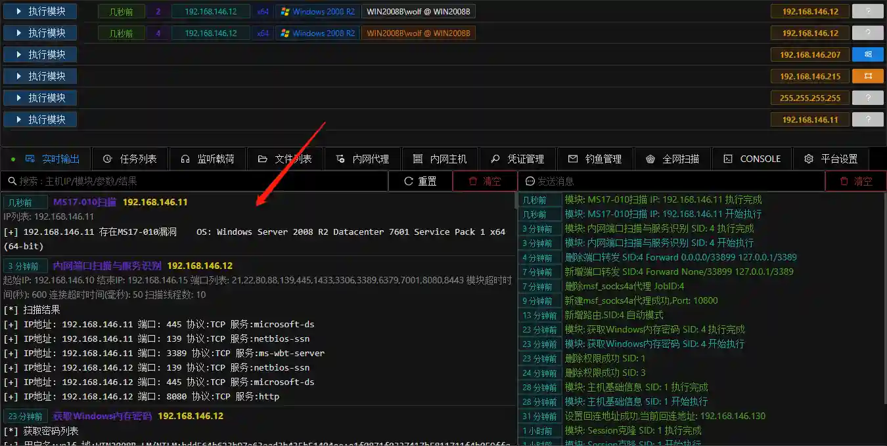

# Horizontal penetration

When we obtain a session of the intranet host, we usually use this session as a springboard/entry point for further intranet penetration.

## Local information collection
### Session Information
+ Select **Permission Operation-Permission Information** Check the Session information, which information is used to confirm what permissions the entry point has, whether it needs to be escalated, whether it is in the domain, operating system and other information.
+ Permission information, determine whether the authority is required. Domain information determines whether the Session requires the next stage of domain information collection/domain penetration.

### Host information
+ After confirming the Session information, we also need to collect more detailed information on the controlled host. For specific operations, please refer to **Host Operation-Host Information**
+ This information is mainly used to confirm how many users are currently logged in to the host, the host version, and is used to subsequently crawl passwords (Windows)
+ **External network connection** It is mainly used to confirm the purpose of the host. Usually, this method is used to quickly find the process that provides services to the external network.
+ **Intranet connection** It is mainly used to view which intranet IP addresses the host is connected to, and to prepare for the next intranet network scanning/intranet vulnerability scanning. Some database connections, RDP connections, SMB connections, etc. can also perform key extraction and other operations.
+ **Important Process** Information is used to identify the host's antivirus software, remote control software and other processes

### This password
+ Thanks to kiwi, we can grab the plaintext password or hash of the controlled windows host to prepare for subsequent penetration.
+ There are multiple modules in VIPER that can complete the work, using ** to obtain the windows memory password** as an example for demonstration

+ The collected credential information can also be viewed in **Certificate Management **

## Network Agent
> Generally, we call the network behind NAT an intranet, and the intranet is currently divided into three types.
>
> The intranet host can directly access the Internet, but the Internet cannot directly access the intranet host (such as a router-based home network)
>
> The intranet host can access the Internet through the proxy server within the enterprise, and the Internet cannot directly access the intranet host (such as many large IT companies or foreign companies)
>
> The intranet host cannot directly access the Internet, and the Internet cannot directly access the intranet host (such as the network of banking, public security and other confidential departments)
>
> The default network in the current chapter is the first network. For the penetration of the second and third networks, please refer to the subsequent chapter of the **Intranet tunnel**
>

### Intranet routing
+ Intranet routing is a transparent proxy based on Session. After adding the corresponding route through Session, the **listening/lateral movement/vulnerability scanning/Socks proxy/vulnerability exploitation and other functions in VIPER will automatically use the route to connect to the corresponding IP address of the intranet.
+ Assume that the VIPER IP address is 45.45.45.45, the intranet IP of Session is 10.10.10.10.10. If you need to connect to 10.10.10.11

**No route added:**

45.45.45 ==>10.10.10.11 (this is not possible to connect)

**When adding routes:**

45.45.45 <=Intranet routing=>10.10.10.10==>10.10.10.11 (this way you can connect)

+ `网络直连`It means that the VIPER server uses direct connection when trying to connect to an intranet host. It is obvious that in most cases, the host cannot connect behind NAT. At this time, we need to add intranet routes on the Session to enable VIPER to connect to the intranet host.

> When automatic is selected, VIPER will add routes based on the IP address configured by the Session host's network card.
>
> If the other party has multiple intranet segments, you can choose to add them manually
>

+ If the corresponding route is added, the route sessionid used to connect to the IP will be prompted to determine which session is used to route.

+ **This is the most commonly used method of forward connection to the intranet, and it is also the default method of connecting to the intranet by VIPER module (MSF module)**

### socks agent
+ The intranet routing in the previous section can only be called by VIPER's built-in functions. External tools (such as Nmap) cannot be used. We can use VIPER's intranet proxy module to build a socks proxy based on intranet routing for external programs to use.

> The traffic forwarding of the socks proxy is based on intranet routing, so make sure that the intranet routing is correctly configured before adding the proxy.
>
> Intranet proxy and intranet routing cooperate with each other
>

### Port Forwarding
+ Intranet routing and socks4a proxy can meet our common intranet forward connection requests. However, sometimes external tools cannot directly use the proxy (mstsc.exe) or some tools require backlinks (Cobalt strike), and port forwarding function is required.

> For detailed help, please refer to the help below the VIPER page.
>

+ If you need to view port forwarding on all permissions, you can view it in the **Intranet proxy**

### External tools
+ There are many external tools that can realize intranet penetration agents, such as the old ew, htran, etc. We recommend several other agent tools. For specific operation methods, please refer to the corresponding documentation.

[https://github.com/fatedier/frp](https://github.com/fatedier/frp)

[https://github.com/FunnyWolf/pystinger](https://github.com/FunnyWolf/pystinger)

[https://github.com/FunnyWolf/TFirewall](https://github.com/FunnyWolf/TFirewall)

[https://github.com/FunnyWolf/ligolo](https://github.com/FunnyWolf/ligolo)

## Intranet network scanning
+ After we have completed the information collection and agent construction of the springboard machine, the next step is to see which hosts the springboard machine can connect to the intranet. At this time, we need to use the intranet network scanning module.

### Intranet port scanning and service identification
+ **Intranet port scanning and service identification** is the most commonly used intranet network scanning module. The module itself will include port detection and fingerprint-based port recognition functions.

+ **Backend Tasks** Tags to view running tasks

+ Run results

+ The scanned host is automatically displayed on the main console. You can also click the Open Port button to view the open port of the host.

> All network connections of the module are carried out in the intranet, so the scanning speed and accuracy are much higher than agent-based intranet scanning.
>
> If you want to scan less traffic and do not trigger an alarm for traffic detection devices in the intranet, you can use the ** intranet port scan**. The module will not perform port service identification, and the usage method is the same as intranet port scan and service identification**
>
> If you are only interested in whether the host is alive, you can use the **intranet arp to scan**
>

## Intranet vulnerability scanning
+ After the network scanning is completed, we can use the vulnerability scanning module to determine which intranet hosts we can attack.

> Before completing the scan, you need to confirm that the intranet route of the corresponding intranet host has been established to ensure that our module can correctly connect to the host
>
> See _Network Agent-Intranet Routing _Chapter
>

### MS17-010 Scan

+ You can also select **known vulnerabilities** to view scanned vulnerabilities

### Intranet horizontal movement
Intranet horizontal movement can be roughly divided into two ways

+ Obtain permissions based on vulnerability, such as MS17-010, weblogic RCE, etc.
+ Obtain permissions based on credential brute force cracking, such as cracking smb, mssql, mysql, etc. of other hosts based on obtained credentials or weak passwords

> Before completing the utilization, you need to confirm that the intranet route of the corresponding intranet host has been established. To ensure that our module can correctly connect the host, please see **Network Agent-Intranet routing**
>

## 

## Frequently Asked Questions
+ Why can't I catch the native password?

> Crawling passwords requires local administrator permissions. There is a certain chance of failure to crawl passwords in Windows Server 2012.
>

+ Why is the Session not obtained using the horizontal moving module?

> The exploit may fail/passed credentials may not log in to the host.
>
> The other host cannot directly connect to VIPER, at this time you can use forward listening (bind_xxx) to try to use it
