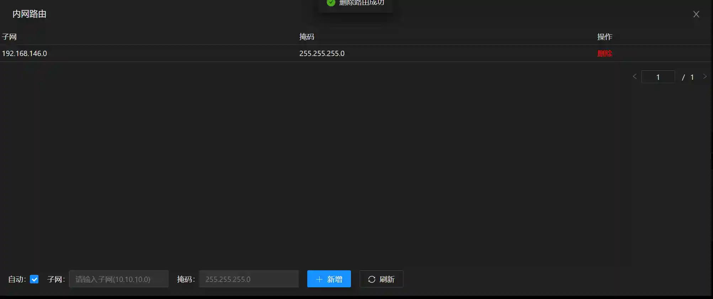
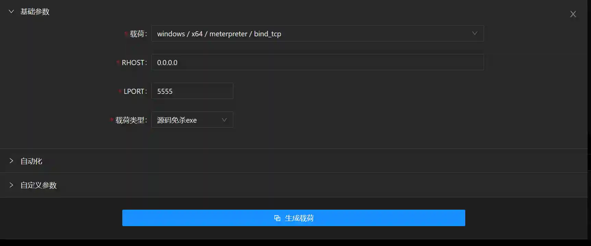
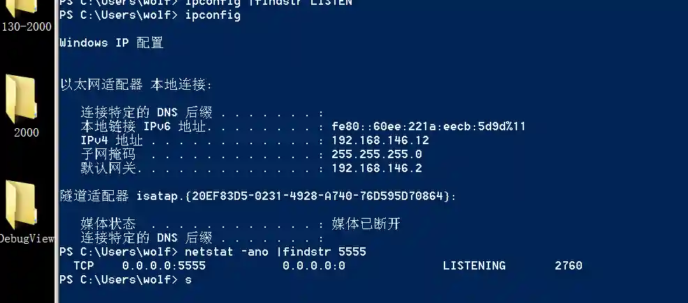
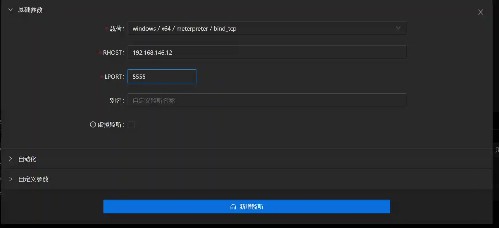

# 不出网主机利用出网主机上线

标题有点绕,但熟悉内网渗透的同学一定遇到过这种场景,话不多说,直奔主题.

这里我们假设`主机A(192.168.146.1)`是出网主机,`主机B(192.168.146.12)`是不出网主机.

## 出网主机可以访问不出网主机的某个端口
> 此场景一般使用`内网路由`和`bind_tcp`类型监听实现`主机B`上线.
>

+ `主机A`正常上线

+ 添加一个到192.168.146.0/24网段的路由
+ 生成一个bind_tcp的载荷,在`主机B`上执行(实战中通过exp执行)

      

+ 运行一个指向`主机B`的监听

+ `主机B`上线

可以看到主机B的Session连接信息是通过`主机A(192.168.146.1)`

## 不出网主机可以访问出网主机的某个端口
> 此场景使用`反向端口转发`及`reverse_tcp`类型监听载荷实现
>

+ `主机A`正常上线

+ 添加一个reverse_tcp_rc4类型监听,记住这里使用的9000端口

> 不要使用reverse_https类型
>

+ 添加一个反向端口转发,记住这里使用的9000端口和12345端口

> 该操作需要已经过UAC的管理员权限
>

+ 生成一个reverse_tcp_rc4类型的载荷,并在`主机B`上执行

> **这里一定注意以下几个参数**
>
> **LHOST填写出网主机的内网IP地址(192.168.146.1)**
>
> **LPORT填写上一步端口转发中 远程端口(监听)的地址 (12345)**
>
> **RC4密码一定要与之前建立监听时RC4密码相同**
>

+ `主机B`上线

因为是使用了反向端口转发,所以Session连接信息是127.0.0.1环路地址

