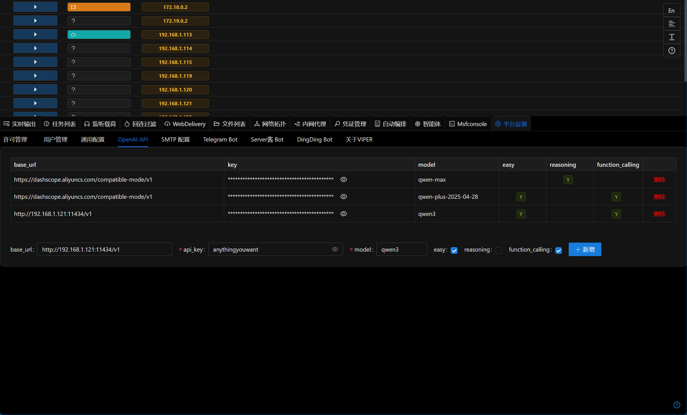

# OPENAI API

智能体依赖于OpenAI兼容的api,使用前请先配置api_key


## Easy / Reasoning / Function_calling

- 可以添加多个配置,每个配置满足不同的功能要求.
- 例如o3-mini,deepseek-r1等选择reasoning标签.用于需要更强规划或推理的任务。
- gpt-4o-mini,qwen-turbo等选择easy,function_calling标签，用于当智能体需要调用api的场景。
- 通过多样化配置可以达到成本/效果/速度的平衡.

## 常用的模型提供商配置方法

Viper兼容所有OpenAI格式的api,你可以使用任意兼容OpenAI接口的模型,以下为常用模型提供商的配置方法,

### Ollama

+ 下载所需的模型

```shell
ollama pull qwen3 # 可以选择任意支持function calling的模型
```

+ 设置OLLAMA_HOST环境变量为0.0.0.0

```shell
export OLLAMA_HOST=0.0.0.0
```

+ 启动ollama服务

```shell
ollama serve
```

+ 在Viper中填写配置,base_url为 http://192.168.1.121:11434/v1 (192.168.1.121为ollama所在ip地址),api_key为任意值,model为pull的model名称(qwen3)

+ 勾选easy和function_calling(reasoning字段当前未使用)



### 阿里云百炼平台

+ 登录阿里云百炼平台 https://bailian.console.aliyun.com/

+ 添加api_key https://bailian.console.aliyun.com/?tab=model#/api-key

+ 访问模型广场,选择需要的模型 https://bailian.console.aliyun.com/?tab=model#/model-market (部分模型有免费额度,推荐使用)

+ 在Viper中填写配置,base_url为 https://dashscope.aliyuncs.com/compatible-mode/v1 ,api_key为上一步生成的key,model为选择的模型(如qwen-plus/qwen-plus-2025-04-28)

+ 勾选easy和function_calling(reasoning字段当前未使用)

### 火山引擎

+ 登录火山引擎 https://console.volcengine.com/

+ 模型广场选择需要的模型

+ 点击`推理`获取base_url和api_key和model

+ 在Viper中填写配置

+ 勾选easy和function_calling(reasoning字段当前未使用)

