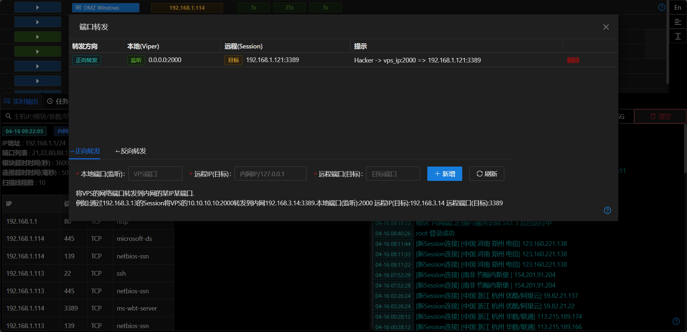
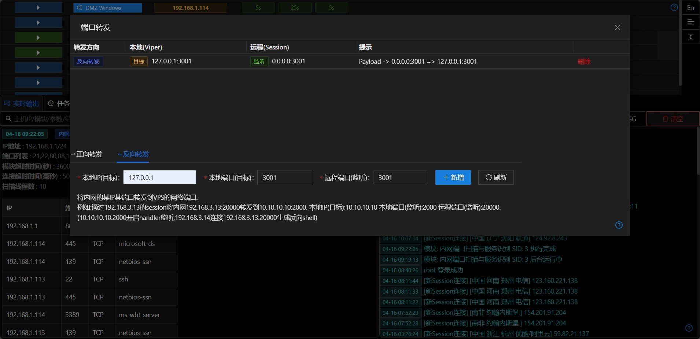

# 端口转发

## 正向转发

+ 正向转发是将VPS的网络端口转发到Session所在内网的某IP某端口.常用于连接内网的某服务,如RDP,SSH等.
+ 如将Session所在主机的127.0.0.1:3389映射到VPS的33899端口,选择`正向`,本地端口`33899`,远程IP`127.0.0.1`,远程端口`3389`
+ `远程IP(目标)` `远程端口(目标)`也可以填写内网其他主机

## 反向转发

+ 反向转发是将内网的某IP某端口转发到VPS的网络端口.
+ 反向转发通常用于handler监听的回连.

+ 假设你已经获取到内网192.168.3.13的权限并建立了Session,你通过一些途径了解到192.168.3.0/24网段的其他机器无法直接连接互联网,也就是无法直接连接你的VPS.

  此时你可以建立反向转发.本地IP`192.168.3.13`,本地端口`2000`,远程IP`127.0.0.1`,远程端口`20000`,所有内网机器连接192.168.3.13:20000就相当于连接VPS的2000端口

  同时在2000端口建立监听并建立一个192.168.3.13:20000的虚拟监听,此时可以使用虚拟监听192.168.3.13:20000作为载荷攻击内网其他机器.即使其无法直接连接VPS.

> 关于监听与虚拟监听相关信息可参考 [监听载荷](./handler_and_payload)

