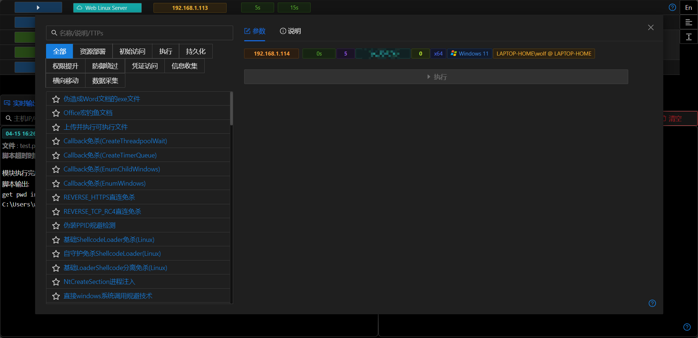

# 运行模块

## 需要Session模块/无需Session模块

+ 当在存在Session的行点击运行模块时,显示所有模块.

+ 如果点击不存在Session的行,则默认只显示不需要Session的模块

## 过滤/查找/标注模块

+ Viper的根据[ATT&TK](https://attack.mitre.org/)对模块进行分类,可以通过选择栏进行过滤选择
+ 支持根据关键字搜索模块,搜索功能会根据名称/TTPs/简介进行匹配

## 参数/说明

+ 左侧点击选择模块后,右侧默认显示模块所需参数.鼠标移到参数上方时自动显示参数说明.

+ 右侧还可以切换到说明选项卡,展示模块的更多信息

## 运行/结果输出

+ 输入参数后点击运行即可运行模块

+ 运行后切换到 `实时输出`可以看到模块运行状态

+ 如果模块运行时间较长,可以在`任务列表`页面查看后台有哪些模块在运行

+ 点击删除按钮会手动终止模块后台运行

> `平台日志`会显示 **模块进入后台** **模块运行时输出的日志** **模块运行结束后提示**
>
> `模块结果`显示模块的运行结果,包括 **运行结束时间** **主机IP** **模块名称** **模块参数** **模块结果输出**等