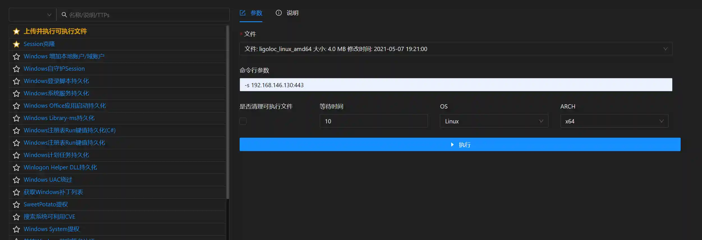

# 上传并执行可执行文件

# 主要功能
将用户指定文件上传到目标机并执行.

功能与在`文件管理`上传文件并执行的逻辑相同,模块主要与`自动编排`功能配合使用,即使用场景如下:

+ 生成一个监听,并将该监听的载荷通过鱼叉钓鱼邮件投递到目标
+ `自动编排`中添加该模块,并指定一个二进制文件(如ligolo,frp,nps等内网穿透工具或定制的木马等)
+ 当有权限上线时会自动上传二进制文件到目标机并执行

# 操作方法
介绍结合`自动编排`的使用方法

+ 在`自动编排`中添加此模块

+ 请注意,在操作中添加了两条模块配置,分别代表Windows类型权限和Linux类型权限所需要上传执行的文件.

+ 上述配置实际运行效果:如新增的权限是Windows系统,则第一条配置检查不通过,自动跳过,第二条配置会生效,如果上线的是Linux系统的权限,同样道理,第一条配置会生效,第二条配置会检查不通过.

