# 横向渗透

当我们获取内网主机的一个 Session 后,通常使用该 Session 作为跳板/入口点进行进一步的内网渗透.

## 本机信息收集
### Session 信息
+ 选择 **权限操作-权限信息** 查看Session信息,信息用于确认该入口点拥有哪些权限,是否需要提权,是否在域中,操作系统等信息.
+ 权限信息,确定是否需要提权.域信息确定 Session 是否需要下一阶段进行域信息收集/域渗透.

### 主机信息
+ 在确定 Session 信息后我们还需要对已控制的主机进行更详细的信息收集.具体操作可以参考 **主机操作-主机信息**
+ 该信息主要用于确认主机当前有多少用户正在登录,主机版本,用于后续抓取密码(Windows)
+ **外网连接** 主要用于确认主机的用途,通常通过该方法快速查找向外网提供服务的进程.
+ **内网连接** 主要用于查看该主机连接了哪些内网 IP 地址,为下一步内网网络扫描/内网漏洞扫描做准备.一些数据库连接,RDP 连接,SMB 连接等还可以进行密钥提取等操作
+ **重要进程** 信息用于识别主机的杀毒软件,远控软件等进程

### 本机密码
+ 感谢 kiwi ,我们可以抓取已控制 windows 主机的明文密码或 hash,为之后的渗透做准备.
+ VIPER 中有多个模块可以完成该工作,以**获取 windows 内存密码**为例进行演示

+ 收集到的凭证信息还可以在 **凭证管理 **中查看

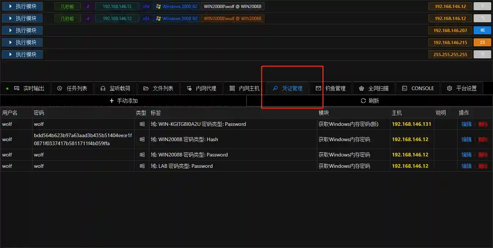

## 网络代理
> 一般我们将 NAT 后面的网络称为内网,当前内网分为三种
>
> 内网主机可直接访问互联网,互联网无法直接访问内网主机(如基于路由器的家庭网络)
>
> 内网主机可通过企业内部的代理服务器访问互联网,互联网无法直接访问内网主机(如很多大型IT企业或外企)
>
> 内网主机不可直接访问互联网,互联网无法直接访问内网主机(如银行,公安等机要部门网络)
>
> 当前章节默认网络为第一种网络.第二三种网络的渗透可参考后续**内网隧道**章节
>

### 内网路由
+ 内网路由是一种基于 Session 的透明代理,通过 Sesison 添加对应路由后,VIPER 中的**监听/横向移动/漏洞扫描/Socks 代理/漏洞利用**等功能会自动使用该路由连接内网对应的 IP 地址.
+ 假设 VIPER IP 地址为 45.45.45.45,Session 的内网 IP 为 10.10.10.10,如需连接 10.10.10.11

**没有添加路由:**

45.45.45.45 ==>10.10.10.11(这是无法连接的)

**当添加路由后:**

45.45.45.45 <=内网路由=>10.10.10.10==>10.10.10.11(这样就可以连接了)

+ `网络直连` 表示 VIPER 服务器在尝试连接内网主机时采用直连的方式,很明显在绝大多数情况下由于主机在 NAT 后面是无法连接的,这时需要我们在 Session 上添加内网路由才能使 VIPER 连接到内网主机.

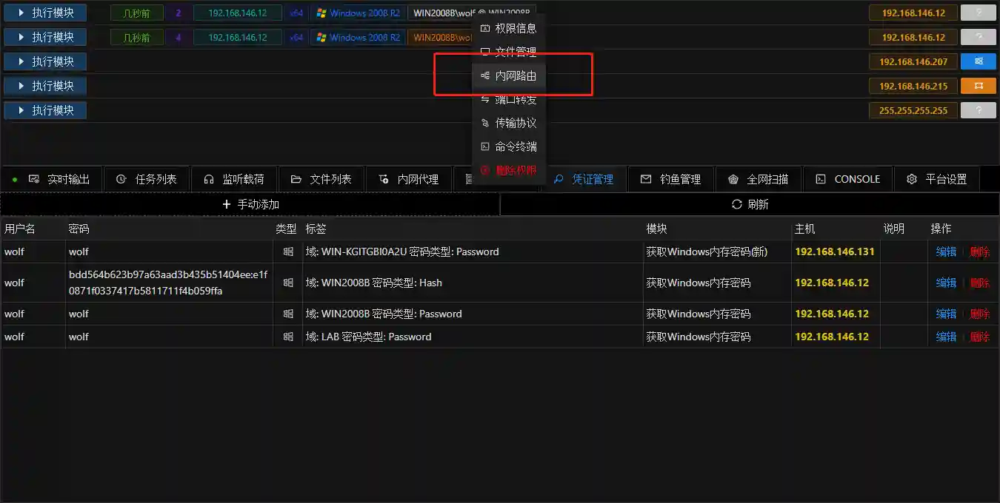

> 选择自动时 VIPER 会根据 Session 主机的网卡配置的 IP 地址添加路由
>
> 如果对方有多个内网网段,可以选择手动添加
>

+ 如果添加了对应的路由,会提示连接该 ip 所用的路由 sessionid ,便于判断是通过那个 Session 进行路由.

+ **这是我们最常用的正向连接内网的方法,也是 VIPER 模块(MSF模块)默认的连接内网方法**

### socks 代理
+ 上一节的内网路由只能由 VIPER 内置的功能进行调用,外部的工具(如 Nmap)是无法使用的,我们可以使用 VIPER 的内网代理模块搭建一个基于内网路由的 socks 代理供外部程序使用

> socks 代理的流量转发是基于内网路由的,所以在添加代理前确保正确配置了内网路由
>
> 内网代理和内网路由是相互配合的
>

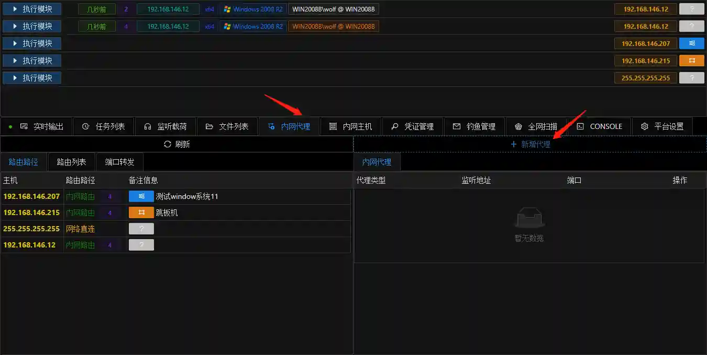

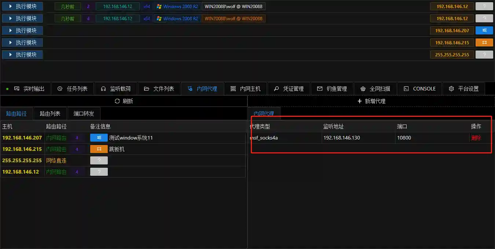

### 端口转发
+ 内网路由及 socks4a 代理可以满足我们常见的内网正向连接的请求.但有些时候外部工具无法直接使用代理(mstsc.exe)或某些工具需要反向链接(Cobalt strike),这时就需要端口转发功能.

> 详细帮助可以参考VIPER页面下方的帮助
>

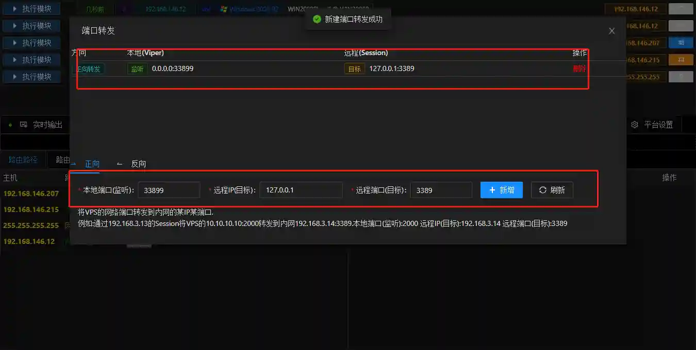

+ 如果需要查看所有权限上的端口转发,可以在**内网代理**中查看

### 外部工具
+ 有很多外部工具可以实现内网穿透型的代理,如老牌的 ew,htran 等,推荐几款其他的代理工具,具体操作方法见对应的说明文档

[https://github.com/fatedier/frp](https://github.com/fatedier/frp)

[https://github.com/FunnyWolf/pystinger](https://github.com/FunnyWolf/pystinger)

[https://github.com/FunnyWolf/TFirewall](https://github.com/FunnyWolf/TFirewall)

[https://github.com/FunnyWolf/ligolo](https://github.com/FunnyWolf/ligolo)

## 内网网络扫描
+ 在我们完成跳板机的信息收集及代理搭建后,下一步就要看一下跳板机能连接内网的哪些主机,这时就需要使用内网网络扫描模块.

### 内网端口扫描与服务识别
+ **内网端口扫描与服务识别**是最常用的内网网络扫描模块,模块本身会包含端口探测及基于指纹的端口识别功能.

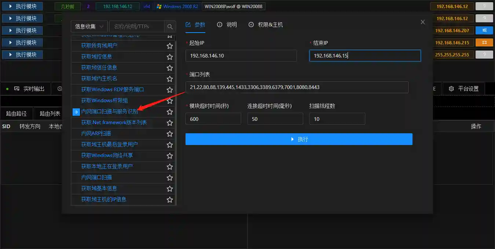

+ **后台任务**标签可以查看正在运行的任务

+ 运行结果

+ 扫描到的主机会自动在主控台显示出来,还可以点击开放端口按钮查看该主机开放的端口

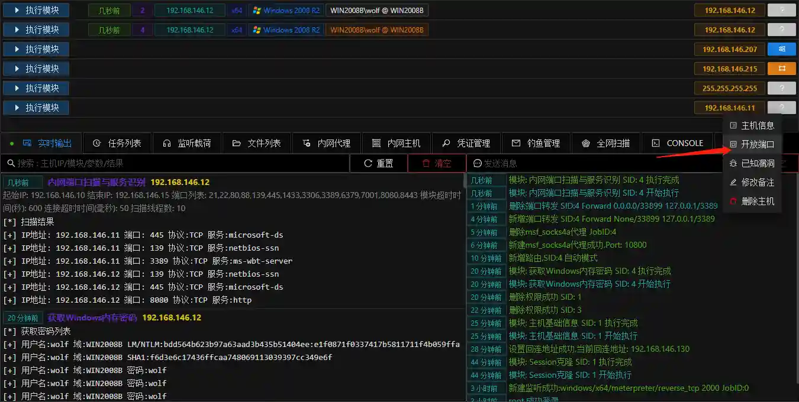

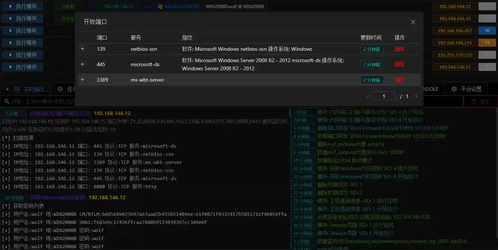

> 模块所有的网络连接都是在内网中进行,所以扫描速度与准确度远高于基于代理的内网扫描.
>
> 如果你希望扫描流量更少,不触发内网中流量探测设备的告警,可以使用**内网端口扫描**,模块不会进行端口服务识别,使用方式与**内网端口扫描与服务识别**相同
>
> 如果你只对主机是否存活感兴趣,可以使用**内网 arp 扫描**
>

## 内网漏洞扫描
+ 在网络扫描完成后,我们可以通过漏洞扫描模块来确定我们可以攻陷哪些内网主机

> 在完成扫描之前需要确认已经建立了对应内网主机的内网路由,确保我们模块可以正确连接该主机
>
> 具体方法见 _网络代理-内网路由 _章节
>

### MS17-010 扫描
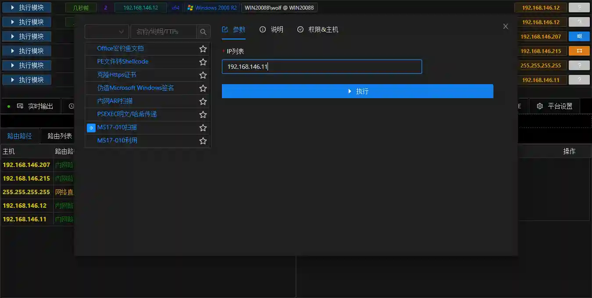

+ 还可以选择**已知漏洞**查看已扫描到的漏洞

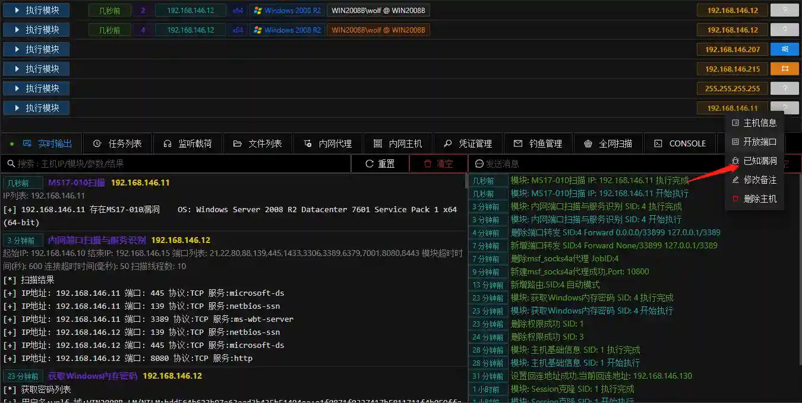

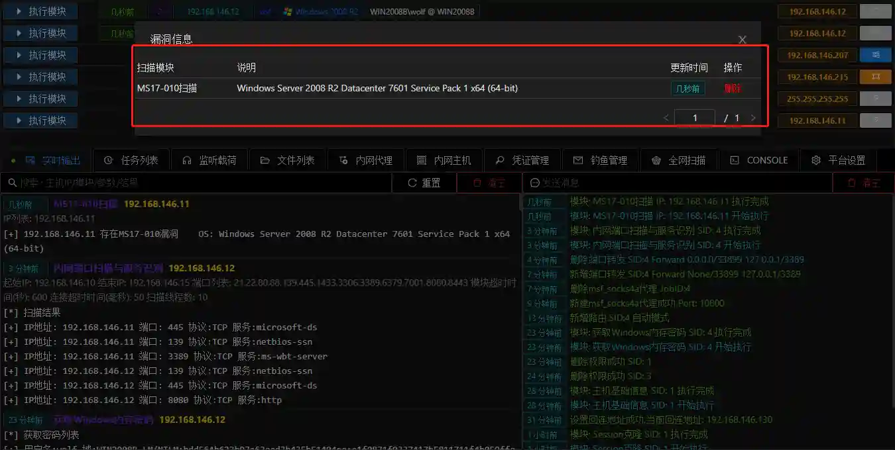

### 内网横向移动
内网横向移动从方式上可以大概分为两种

+ 基于漏洞的方式获取权限,如 MS17-010,weblogic RCE 等
+ 基于凭证暴力破解方式获取权限,如基于获取到的凭证或弱密码破解其他主机的 smb,mssql,mysql 等

> 在完成利用之前需要确认已经建立了对应内网主机的内网路由,确保我们模块可以正确连接该主机具体方法见**网络代理-内网路由**
>

## 

## 常见问题
+ 为什么我无法抓取到本机密码?

> 抓取密码需要本地管理员权限,在 windows server2012 抓取密码有一定几率失败.
>

+ 为什么使用横向移动模块没有获取到 Session?

> 漏洞利用可能会失败/传递的凭证可能无法登陆该主机.
>
> 对方主机无法直接连接 VIPER,这时你可以使用正向监听(bind_xxx)尝试利用
